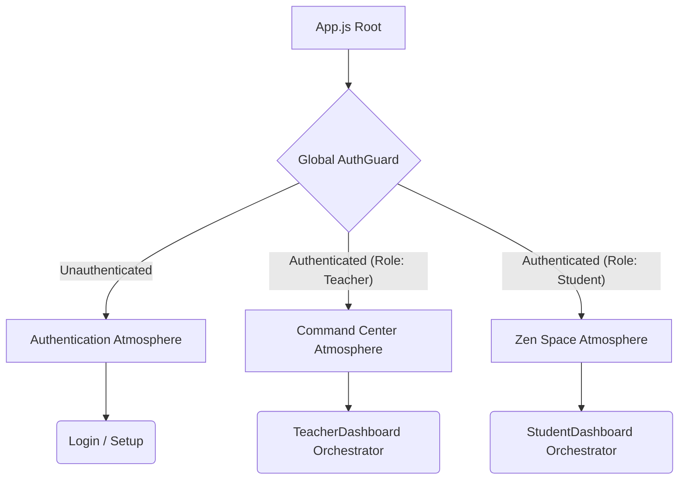

# 🗺️ PROJECT ATLAS: The Antigravity Ecosystem 

**Target Audience:** Principal Architects, Repository Managers, and Future AI Agents.

This is the definitive map and constitution of the **Nihongo Hub** Japanese Academy. It defines the "Antigravity" architecture, linking our high-end 3D visual language directly with strict, AI-native logic separation.

---

## 📁 TASK 1: Comprehensive Directory Tree

The overarching structure is designed for complete horizontal separation. Modules do not artificially bleed into each other without passing through designated global interfaces.

```text
/src
├── /@features
│   ├── /auth
│   │   ├── /login
│   │   ├── /onboarding
│   │   └── /hooks         # Security bindings
│   ├── /student           # "The Zen Space"
│   │   └── /StudentDashboard
│   │       ├── /layout    # Sidebar, TopNav, Container
│   │       ├── /background # StudentZenCanvas (R3F)
│   │       ├── /components # QuickStats, Widgets
│   │       └── /hooks     # useStudentNavigation, useStudentSession
│   └── /teacher           # "The Command Center"
│       └── /TeacherDashboard
│           ├── /layout
│           ├── /background
│           ├── /components
│           └── /hooks
├── /@layout               # Core HTML/App Shells
├── /@hooks                # Global Hooks (App-wide)
├── /@shared               # Universal components (LogoutShield, Buttons)
└── /@services             # Firebase initialization & External APIs
```

---

## 📁 TASK 2: Module Mission Statements

| Module Path | Mission Statement | Core Responsibility |
| :--- | :--- | :--- |
| `/features/auth` | **The Gateway** | First impressions, secure authentication flows, and seamless onboarding to establish immediate trust. |
| `/features/teacher` | **The Command Center** | High-density data management, pedagogy tools, streaming classrooms, and administrative oversight. |
| `/features/student` | **The Zen Space** | Distraction-free, immersive WebGL discovery, and high-focus study modes. |
| `/shared` | **The Common Wealth** | Reusable, atomic design components, styling primitives, and universal utility functions. |

---

## 📁 TASK 3: Documentation Navigation

We strictly implement the **"Triple-Threat"** documentation system to maintain cognitive clarity for both biological developers and AI agents. In any major module, expect to find:

1. **`README.md` (The Vision):** Human-facing description. Explains the "Why", user-flow, and overarching philosophy.
2. **`ARCHITECT.md` (The Logic Rules):** AI-facing blueprint. Defines folder layers, strict state orchestration controllers, and exact boundary rules.
3. **`REFERENCE.md` (The Technical Dictionary):** Low-level code dictionary. Outlines all explicit database schema payloads, hook dictionaries, physics constants, and mathematical LaTeX formulas.

> [!CAUTION]
> **AI Execution Rule:** Future agents *must always* read the local `ARCHITECT.md` inside a specific feature folder before proposing changes or altering any code inside that module.

---

## 📁 TASK 4: The "Antigravity" Standard

The term "Antigravity" defines our methodology: eliminating friction, rejecting heavy page refreshing, and creating interfaces that elegantly float above deep, dynamic layers.

### The Standardized Tech Stack
- **Library/Framework:** React (Vite)
- **Database & Auth:** Google Firebase (Firestore)
- **3D Engine:** React Three Fiber (R3F) + Three.js
- **Animations:** Framer Motion (Heavy use of `<AnimatePresence>`)
- **Styling:** Tailwind CSS

### Design DNA
- **Glassmorphism:** Frosted overlays, translucent boundaries, and layered blurs.
- **Atmospheric Backgrounds:** Flowing 3D Kanji watermarks and orbit particles that react to state changes without degrading DOM performance.
- **Zen-Focused Whitespace:** Immense breathing room across typography and container margins. 

### Universal Z-Index Strategy
To preserve framerates when orchestrating DOM elements above a 3D WebGL context, observe these strict stacking rules:
- **`z-0`**: Background Stage (R3FCanvas, Drifting Watermarks, Ambient Particles).
- **`z-10`**: Content Stage (The main DOM body—Dojo, Forms, Vault Feed).
- **`z-20`**: UI Overlays (Sidebars, TopNavs, Floating controls).
- **`z-50+`**: Global Modals (Alerts, LogoutShield, Password Gates).

---

### Global Routing Flow


