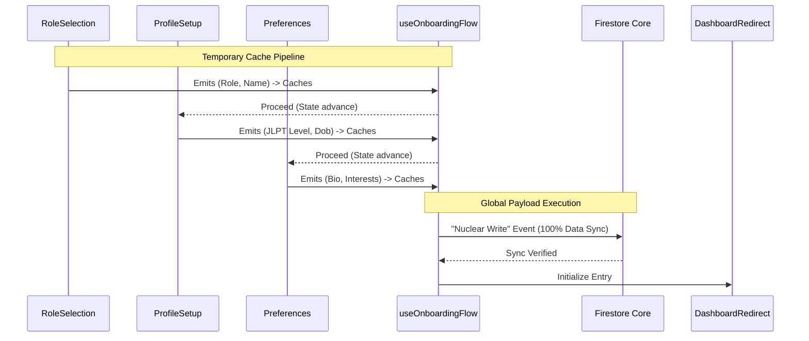

# ARCHITECT.md

> **TARGET AUDIENCE:** Full-Stack Developers and Data-Pipeline Agents.
> **FOCUS:** State machine logic, component mapping, and Firestore interactions.

---

## 🏛️ The Engine Blueprint

The onboarding sequence operates inherently as a rigid, step-based state machine. The orchestrator isolates views specifically to prevent overwhelming the user.

### 1. Architectural Rules
- **Absolute Independence:** Every step (e.g., `RoleSelector.jsx`, `ProfileSetup.jsx`) must exist as a fully insulated atomic unit. They do not know about adjacent steps.
- **Dumb Orchestrator:** The root `Onboarding.jsx` file does fundamentally nothing except parse the active `currentStep` index and render the associated atomic file via `<AnimatePresence>`.

### 2. The Data Cache Protocol
This module uses a **Temporary Memory Cache** pattern. Payload values typed during Step 1 are piped into the master hook, but *no network events occur*. The hook simply stockpiles the object data in browser RAM.

Only upon executing the final step does the environment initiate the **"Nuclear Write"**. It compiles the entire form payload into a single, massive Firestore dispatch targeting the `users` collection. This prevents fractured user datasets if a session drops midway.

---

## 🔄 Logic Pipeline

