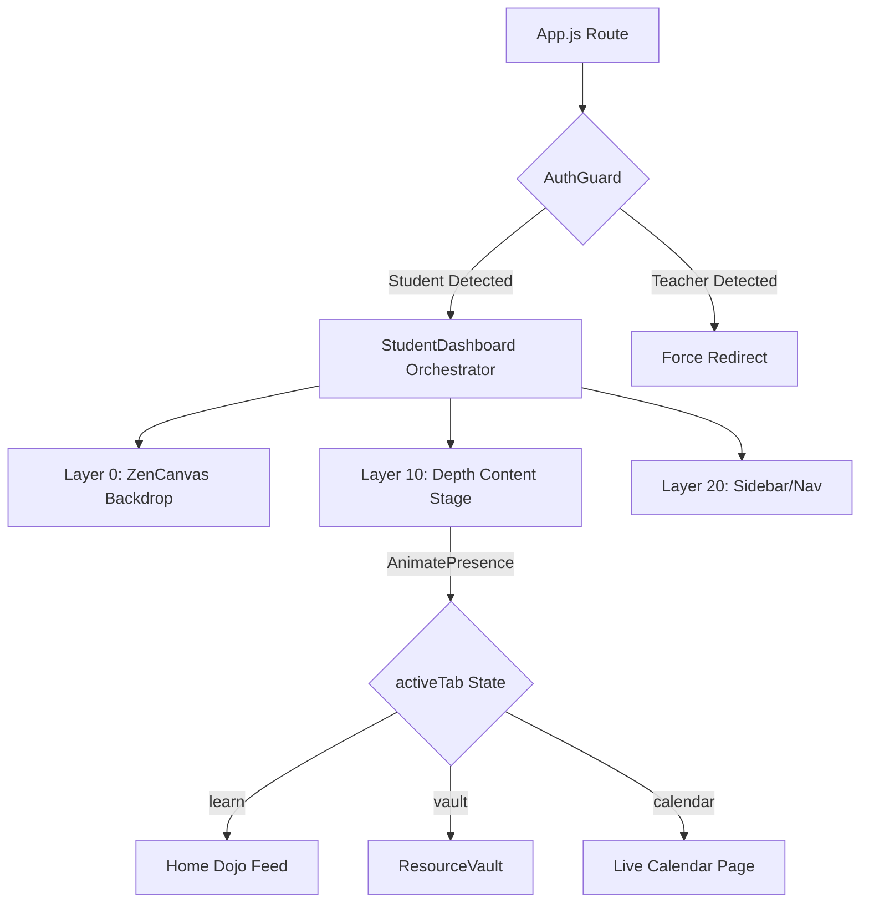

# Architecture Map: Student Dashboard

**Target User:** AI Co-pilots & Future Architects

This document defines the strict segregation of logic perfectly separating background immersion, frontend shell, and volatile business logic.

## 📂 Directory Anatomy

```text
/StudentDashboard
├── /layout
│   # Structural shells (StudentShell, StudentSidebar, StudentTopNav).
│   # Defines persistent boundaries using fixed pos and high Z-index margins.
├── /background
│   # The isolated 3D environment (StudentZenCanvas).
│   # Utilizes R3F/Three.js patterns optimized for zero-blocking main thread updates.
├── /hooks
│   # Abstracted business logic (useStudentNavigation, useStudentProgress/Session).
│   # Subscriptions to Firebase and navigation manipulation.
└── /components
    # Reusable, atomic student UI units (QuickStats, ActionCards, DashboardWidgets).
```

## 🧠 State Orchestration

**Controller:** `hooks/useStudentNavigation.js`
All spatial mounting and unmounting of the Dashboard's sub-pages must flow through this central Hook. It controls the master `activeTab` string and passes routing commands downward. Rather than heavy conditional JSX arrays, the orchestrator mounts targeted components inside the AnimatePresence envelope based on this state.

## ⚖️ Antigravity Layering Rules

The architecture relies strictly on absolute dimensional stacking to prevent DOM repaints from colliding between UI elements and the 3D Canvas.

### Z-Index Blueprint

- **Layer 0 (`z-0`)**: The Background Stage. (`StudentZenCanvas`). Drifting Kanji and particles.
- **Layer 1 (`z-10`)**: The Content Stage. Bounded space where standard DOM content (Dojo, Vault, Forms) is painted.
- **Layer 2 (`z-20+`)**: The Controls. (`StudentSidebar`, Modals, `StudentTopNav`).

### Motion Standards: The "Zen Transition"

When shifting tabs in the Content Stage, we execute a "Depth-Dissolve" physical engine using `framer-motion`'s `<AnimatePresence mode="wait">`.

```javascript
// Depth Dissolve transition strictly to be used
const pageVariants = {
  initial: { opacity: 0, scale: 0.95, filter: "blur(4px)" },
  animate: {
    opacity: 1,
    scale: 1,
    filter: "blur(0px)",
    transition: { duration: 0.4, ease: "easeOut" },
  },
  exit: {
    opacity: 0,
    scale: 1.02,
    filter: "blur(4px)",
    transition: { duration: 0.3, ease: "easeIn" },
  },
};
```

## 🔄 Logic Flow


