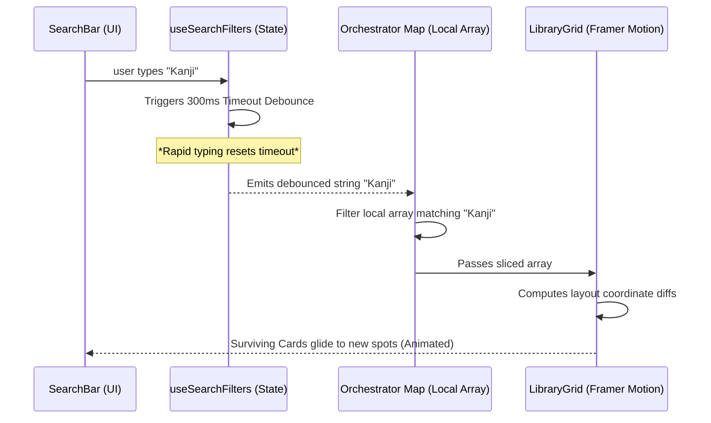

# ARCHITECT.md

> **TARGET AUDIENCE:** Future AI Co-pilots, Build Bots, and Interface Engineers.
> **FOCUS:** Data Consumption topology and UI Constraints mapping.

---

## 🏛️ Module Anatomy
The Student Resource Vault leverages a strictly decoupled React paradigm to ensure maximum rendering efficiency during heavy grid animations.

```text
/ResourceVault
  ├── /components    # Atomic UI (ResourceCard, SearchBar, CategoryFilter)
  ├── /hooks         # Logic streams for data fetching and debounced filtering
  ├── /services      # Pure abstraction for (mostly read-only) Firestore queries
  └── ResourceVault.jsx # The active Layout Orchestrator
```

## 🧠 Data Orchestration
**`useVaultResources.js`** is the data lifeline.
Instead of querying raw documents on every render loop, this hook subscribes to the designated course batch `resources` array inside Firestore. Once authorized, it feeds a local Javascript array to the client. This guarantees that deep-filtering and string-matching algorithms compute entirely via local memory rather than hitting network endpoints, maintaining an absolute 60FPS lock.

## 🧊 The Antigravity Rules (UI Strictness)

### 1. Motion Standard
When arrays re-render, component entries must explicitly trigger `<AnimatePresence>`. 
Implementation explicitly requires a **staggered delay of `0.03s`** across lists to achieve the cascading "waterfall" entrance effect.

### 2. Layout Transitions
The grid container must wrap the items using Framer Motion's `<LayoutGroup>`. Furthermore, individual structural elements must strictly pass the `layout` prop (e.g., `<motion.div layout>`). This informs the physics engine to "fly" the cards to their new coordinates whenever arrays splice via filtering.

### 3. State Isolation (Zero-Jitter Constraint)
Search states are heavily isolated. Input captures are sent to `useSearchFilters.js` where they are **debounced buffer-locked at 300ms**. The actual Layout Grid refilters *exclusively* on the debounced value, preventing UI thread jitter during rapid typing inputs.

---

## 🔄 Interaction Flow topology


