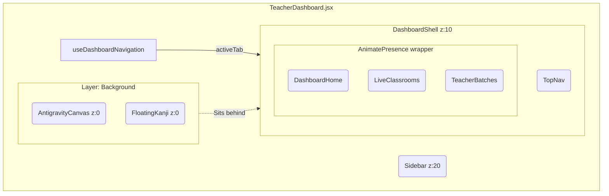

# ARCHITECT.md

> **TARGET AUDIENCE:** Future AI Co-pilots, Build Bots, and Root System Integrators.
> **FOCUS:** Folder Responsibilities, Z-Index Constraints, and State Routing Pipelines.

---

## 🏛️ Directory Anatomy
The root Teacher Dashboard operates strictly as a Layout Orchestrator. It enforces deep fragmentation of logic to maintain ultimate pure-component execution speeds.

```text
/TeacherDashboard
  ├── /layout         # Structural shells and persistence (e.g. Sidebar, TopNav, DashboardShell)
  ├── /background     # The isolated physics world (e.g. AntigravityCanvas, FloatingKanji)
  ├── /hooks          # Controllers for navigation and auth streams (Business Logic layer)
  ├── /components     # System-wide reusable micro-UI widgets (e.g. ZenToggle, NotificationToast)
  ├── /DashboardHome  # The internal sub-module rendering the default "Academy Command"
  └── TeacherDashboard.jsx # Core Entry Router
```

## 🧠 State Orchestration
**`useDashboardNavigation.js` acts as the Traffic Controller.**
This hook exclusively manages the global user intent (e.g., Tab shifting, Sidebar mechanics). The Orchestrator `TeacherDashboard.jsx` merely listens to the `activeTab` string produced by this hook to determine which massive sub-module component to mount.

## ⚠️ Antigravity Layering Rules (CRITICAL)

### 1. The Strict Z-Index Map
Violations of this map destroy the depth-of-field immersion and break click-handlers.
- **`z-index: 0` (Background):** Exclusively reserved for `/background` layers (3D models, R3F, Kanji). Must carry `pointer-events-none`.
- **`z-index: 10` (Content Stage):** The interactive structural wrapper holding all data grids and sub-modules.
- **`z-index: 20+` (Sidebar & Overlays):** Reserved for Modals, the structural Navigation sidebars, and critical overlay shells.

### 2. Motion Standard (Physics Constraint)
If implementing layout or presence animations inside the overarching Dashboard, you absolutely must use the standardized Spring configuration:
`transition={{ type: "spring", stiffness: 300, damping: 30 }}`

### 3. Conditional Mounting & GPU Safety
Sub-modules (like `TeacherBatches` or `LiveClassrooms`) **must heavily exploit** `<AnimatePresence mode="wait">`. Subscribed sub-modules **MUST** be explicitly unmounted rather than hidden with CSS `display: none`. This clears up intensive React memory and guarantees rendering limits are reserved entirely for the GPU-heavy R3F Kanji backgrounds.

## 🔄 Architectural Topology


