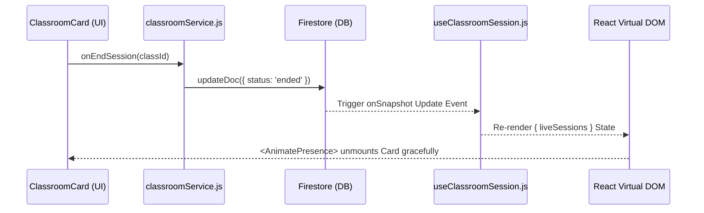

# ARCHITECT.md

> **TARGET AUDIENCE:** Future AI Agents, Co-pilots, and System Maintainers.
> **FOCUS:** Logic flows, systemic constraints, data schemas, and rigid architectural boundaries.

---

## 🏛️ Module Anatomy
The LiveClassrooms module enforces a strict separation of concerns to guarantee atomic re-usability and AI-driven modularity.

```text
/LiveClassrooms
  ├── /components    # (UI) Pure, presentational layout fragments (e.g., ClassroomGrid, ClassroomCard)
  ├── /hooks         # (State) Real-time binding and business logic (e.g., useClassroomSession)
  ├── /services      # (Network) Direct Firebase/Firestore mutations (e.g., classroomService)
  ├── /constants     # (Enums) Ground-truth variables and types (e.g., CLASSROOM_STATUS)
  └── LiveClassrooms.jsx # The Orchestrator Layout Group
```

## 🧠 State Orchestration
**`useClassroomSession.js` is the Absolute Single Source of Truth.**
All `onSnapshot` listeners and real-time state aggregates *must* live within this hook. Components are only allowed to consume the data. Direct Firestore reads within UI fragments are strictly prohibited to prevent data desynchronization and memory leaks.

## 🗃️ Data Schema

### `classes` Collection
```typescript
interface ClassroomDoc {
  id: string; // Document ID
  hostId: string; // UID of the active Teacher
  type: string; // e.g., 'group', '1-on-1'
  batchLevel: string; // Security mapping to user roles
  status: 'idle' | 'live' | 'ended'; // Governs visibility in Active Grid
  activeParticipants: number; // Stored integer for read-efficiency
  roomID: string; // Target WebRTC allocation
  password?: string; // Optional AES lock key
  endedAt?: Timestamp;
}
```

## ⚠️ The Antigravity Rules (STRICT CONSTRAINTS)

You **must** adhere indefinitely to the following guidelines when refactoring or creating future capabilities:

1. **Atomic Design:** UI components must remain pure functions calculating visually. All intelligent logic, state derivations, and calculations must live in `/hooks`.
2. **Transactions:** When performing any state mutations affecting multiple users simultaneously (e.g., mass-kicks, status flags combined with roster updates), you **MUST** use Firestore `runTransaction`. 
3. **Animation Constants:** All new physics-based `framer-motion` properties must utilize the following "Antigravity Default":
   `transition={{ type: 'spring', stiffness: 300, damping: 25, mass: 0.5 }}`
4. **React Hook Safety:** Strictly prohibit invoking React Hooks (`useState`, `useEffect`, `useClassroomSession`) inside loops, conditions, or nested functions.

## 🔄 Core Logic Flow

Below dictates the immutable chain-reaction when a mutation occurs within the `LiveClassrooms` node:


